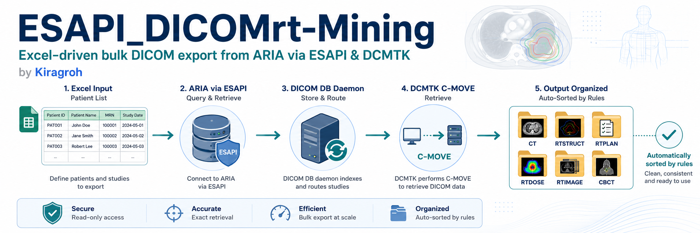
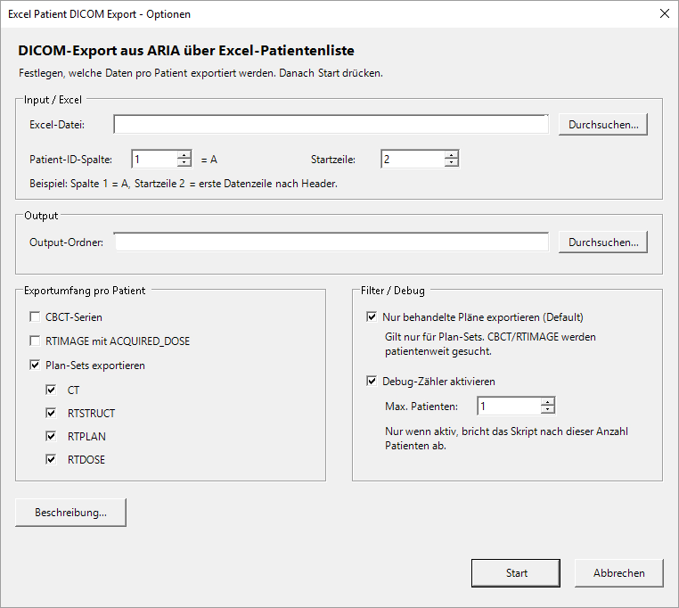

# ESAPI_DICOMrt-Mining

## General ESAPI Guidance

For current build/runtime notes, clinical-safety reminders, stand-alone threading rules, write-enabled script governance, and ESAPI 18.x considerations, see [`docs/ESAPI_GENERAL_NOTES.md`](docs/ESAPI_GENERAL_NOTES.md).



**Excel-driven bulk DICOM export from Varian ARIA via ESAPI and DCMTK movescu.**

> **Independent project:** This is a personal technical example, not an
> official publication, product, approval, or support service of any employer,
> healthcare provider, university, or vendor. Configuration values are
> synthetic. The software is provided without warranty and requires local
> licensing, security review, validation, and governance before use.

Reads a list of patient IDs from an Excel file, connects to the ARIA database via ESAPI, and exports any combination of the following modalities per patient using C-MOVE (DCMTK `movescu`):

- Planning CT
- RTSTRUCT
- RTPLAN
- RTDOSE
- Portal dose images (RTIMAGE / ACQUIRED_DOSE)
- CBCT series

---

## Why ESAPI + C\#?

The DICOM DB Daemon accepts C-MOVE requests keyed by **DICOM UIDs** (SeriesInstanceUID, SOPInstanceUID). The central challenge in bulk export is *obtaining* those UIDs for each patient, plan and image.

**ESAPI is the cleanest path to those UIDs.** It provides structured, read-only access to the full ARIA object model — patients, courses, plans, structure sets, doses, series — without requiring direct SQL access to the ARIA database. Querying ARIA SQL directly is technically possible but complex, fragile across ARIA versions, and necessary UIDs are in LiveDB where you dont get access from Varian anymore.

> **Note:** ESAPI is only required for the UID-lookup step. The actual DICOM transfer goes through the **ARIA DICOM DB Daemon** and is completely independent of ESAPI. If you already have UIDs from another source (e.g. a DICOM query/retrieve or a custom database export), you can talk to the daemon directly with any C-MOVE-capable tool — no ESAPI or C# needed.

---

## Building & Getting Started

### Visual Studio

This is a standalone C# console application compiled with **Visual Studio**. [Visual Studio Community Edition](https://visualstudio.microsoft.com/vs/community/) is free for individual developers, open-source projects, and academic/research use — check the license terms for your use case.

### Standalone script vs. single-file plugin

Varian ESAPI scripts come in two flavours:

| | Single-file plugin | Standalone script |
|---|---|---|
| Format | `.cs` file, no compilation needed | Compiled `.exe` |
| Context | Runs inside Eclipse, single patient open | Runs independently, batch-processes any number of patients |
| Use case | Interactive tools, quick utilities | **Batch export, data mining — this script** |

A single-file plugin example (patient context, no build required) is linked in the References (Varian-Wiki). For bulk processing across a patient list, a standalone executable is the right approach.

### Quickstart: bootstrapping with the Eclipse Scripting Wizard

The recommended way to get this running at your site:

1. Use the **Eclipse Scripting Wizard** to create a new empty standalone project and open VisualStudio. This wizard sets up the correct project structure, target framework, and ESAPI references automatically. The full walkthrough is shown in the **Varian API Book, Chapter 4** (see References).
2. Once the empty project is created, **replace the generated `.cs` file** with `Mining_ListOfPlans2DICOM.cs` from this repository.
3. Resolve the EPPlus NuGet reference (`Install-Package EPPlus` in the Package Manager Console).
4. Copy `settings.example.ini` → `settings.ini` next to the built `.exe` and fill in your site-specific values.

---

## Prerequisites

| Component | Requirement |
|---|---|
| .NET Framework | 4.8 |
| ESAPI | Varian Eclipse/ARIA SDK (`VMS.TPS.Common.Model.API`) |
| ARIA DICOM DB Daemon | configured and reachable (see Setup below) |
| DCMTK | `movescu.exe` – included as `Assets/DCMTK.zip` or install system-wide |
| EPPlus | `EPPlus.dll` – included in build output (NuGet: EPPlus >= 5, NonCommercial) |

> The ESAPI DLLs (`VMS.TPS.Common.Model.API.dll`, `VMS.TPS.Common.Model.Types.dll`) must be obtained from your local Eclipse/ARIA installation and are **not** part of this repository.

---

## Setup

### 1 – Configure the ARIA DICOM DB Daemon

The export uses the **ARIA DICOM DB Daemon** as the DICOM communication layer. The daemon exposes a C-MOVE SCP; `movescu` sends a C-MOVE request and ARIA delivers the DICOM files to a Storage SCP (here: the `ScriptExport` share).

Detailed documentation:
- **Varian Wiki:** [Scripting the Varian DICOM DB Daemon with ESAPI](https://github.com/VarianAPIs/Varian-Code-Samples/wiki/Scripting-the-Varian-DICOM-DB-Daemon-with-ESAPI)
- **Varian API Book (PDF), Chapter 4:** [varianapis.github.io/VarianApiBook.pdf](https://varianapis.github.io/VarianApiBook.pdf)

A compact step-by-step setup guide is included as `Assets/DICOM_Daemon_Setup_Quick_Guide.docx`.

Required `settings.ini` parameters:

| Parameter | Description |
|---|---|
| `AET` | AE Title of the local movescu client (must be registered in the daemon as a caller) |
| `AEC` | AE Title of the ARIA DICOM DB Daemon (Called AE, e.g. `DICOM_ESAPI`) |
| `AEM` | AE Title of the move-destination Storage SCP (e.g. `ScriptExport`) |
| `DICOM_HOST` | IP address or hostname of the ARIA DB server |
| `DICOM_PORT` | Port of the ARIA DICOM Daemon |
| `ESAPI_IMPORT_BASE` | UNC path of the ScriptExport share (e.g. `\\ARIASERVER\DICOM_ESAPI_ScriptExport`) |

> **Alternative communication layers:** Any tool that supports C-MOVE-SCU can replace DCMTK, e.g. [fo-dicom](https://github.com/fo-dicom/fo-dicom), [pynetdicom](https://github.com/pydicom/pynetdicom), or [dcm4che](https://www.dcm4che.org/). Adapt the `RunMoveScu()` method (~line 814) accordingly.

### 2 – Provide DCMTK

**Option A – bundled package (recommended):**

```
Extract  Assets\DCMTK.zip  →  Assets\DCMTK\
```

Result must be `Assets\DCMTK\bin\movescu.exe`. This path is already the first entry in `DCMTK_PATHS`.

**Option B – system-wide install:**

Download DCMTK from [dcmtk.org](https://dcmtk.org/) and add the `bin` path to `DCMTK_PATHS` in `settings.ini`.

### 3 – Create settings.ini

```
Copy  settings.example.ini  →  settings.ini
```

`settings.ini` lives next to the `.exe` (build output folder). Minimum required values:

```ini
DICOM_HOST=<IP or hostname of the ARIA server>
DICOM_PORT=<port of the ARIA DICOM Daemon>
ESAPI_IMPORT_BASE=\\<ARIA-Server>\<ScriptExport share>
EXPORT_BASE=<local or UNC output path>
```

See `settings.example.ini` for the fully commented template with all available keys.

> `settings.ini` is listed in `.gitignore` and will never be committed to the repository.

### 4 – Prepare the Excel file

- First worksheet, column A (configurable via `EXCEL_ID_COLUMN`): ARIA patient IDs
- Row 1 = header, data starts at row 2 (configurable via `EXCEL_START_ROW`)

---

## Usage

```
Mining_ListOfPlans2DICOM.exe [optional: path to Excel file]
```

An options dialog opens at startup.



Export toggles and paths can be adjusted for each run. All settings are saved to `settings.ini` on confirmation.

### Output structure

```
EXPORT_BASE\
  <PatientId>\
    <CourseId>_<PlanId>\
      CT\*.dcm
      RTSTRUCT\*.dcm
      RTPLAN\*.dcm
      RTDOSE\*.dcm
      RTIMAGE\*.dcm        <- portal dose images (matched by beam ID)
    CBCT\
      <YYYYMMDD_HHMM>_<StructureSetId>\*.dcm
    RTIMAGE\
      <YYYYMMDD>\*.dcm     <- unmatched ACQUIRED_DOSE images
```

---

## Assets

| File | Contents |
|---|---|
| `Assets/DCMTK.zip` | DCMTK 3.6.x Windows 64-bit (dynamic) – extract to `Assets/DCMTK/` |
| `Assets/DICOM_Daemon_Setup_Quick_Guide.docx` | Step-by-step guide for setting up the ARIA DICOM DB Daemon and ScriptExport |

---

## References

- Varian Code Samples Wiki – [Scripting the Varian DICOM DB Daemon with ESAPI](https://github.com/VarianAPIs/Varian-Code-Samples/wiki/Scripting-the-Varian-DICOM-DB-Daemon-with-ESAPI)
- Varian API Book (PDF) – [varianapis.github.io/VarianApiBook.pdf](https://varianapis.github.io/VarianApiBook.pdf), Chapter 4: DICOM DB Daemon
- [DCMTK – DICOM Toolkit](https://dcmtk.org/)
- [EPPlus – Excel library for .NET](https://www.epplussoftware.com/)

---

## License

This script is intended for research and technical evaluation. It is not a
medical device and is not validated for direct clinical decisions. EPPlus is
used in NonCommercial mode (`ExcelPackage.LicenseContext =
LicenseContext.NonCommercial`). A commercial EPPlus license is required for
commercial use.
